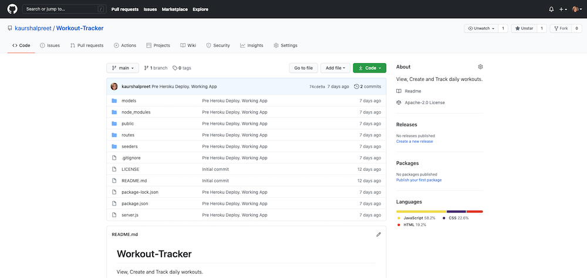
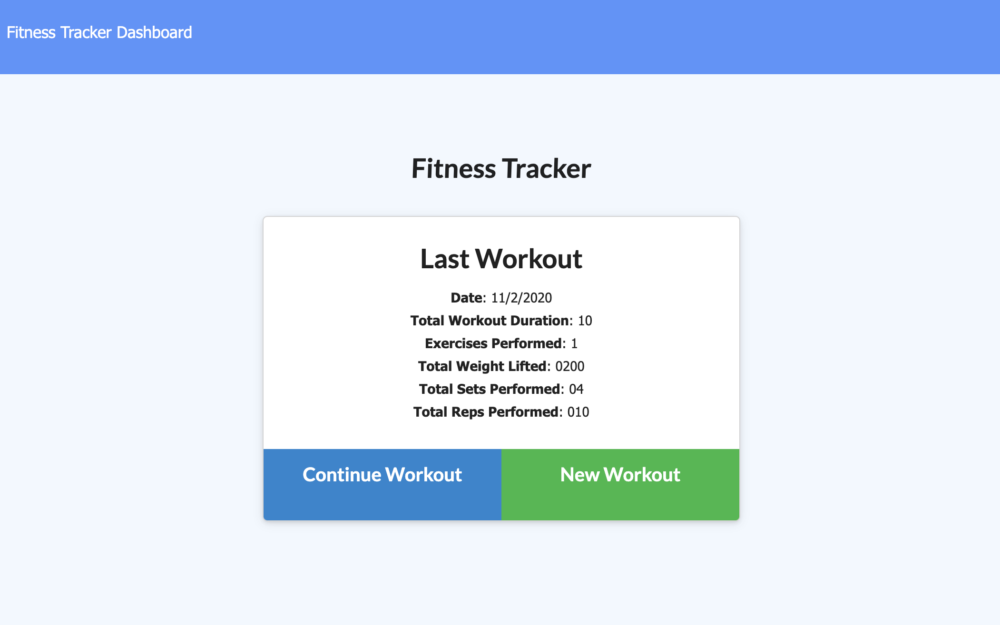
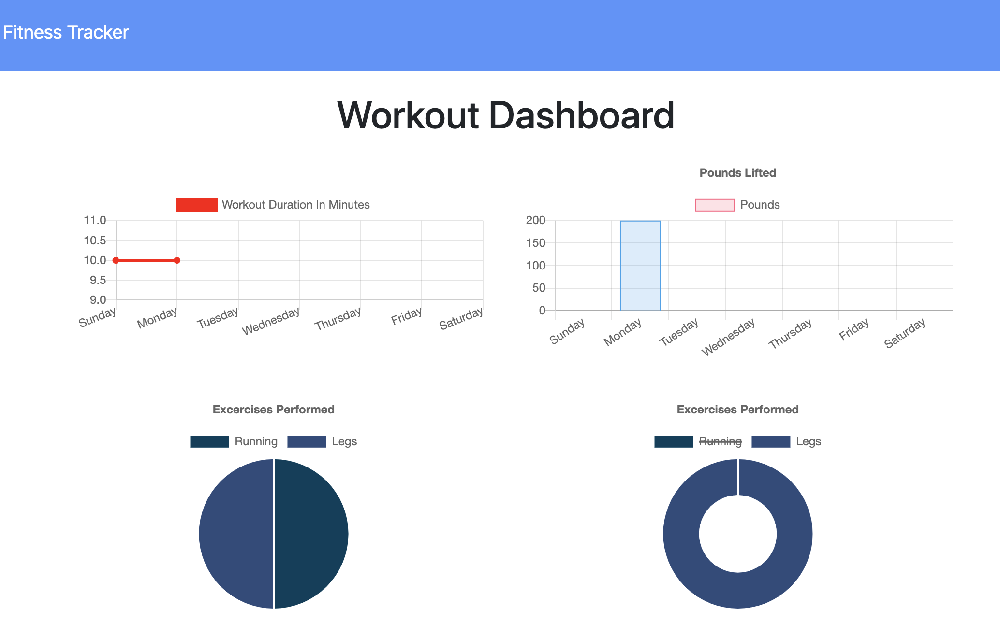

# Workout-Tracker
View, Create and Track daily workouts.

## Description

Workout Tracker is an app where user will be able to create and track daily workouts and will be able to log multiple exercises in a workout on a given day. A user will also be able to track the name, type, weight, sets, reps, and duration of exercise. If the exercise is a cardio exercise, user will be able to track the distance traveled. A consumer will reach their fitness goals more quickly when they track their workout progress.  

[The Link to My Github Repository](https://github.com/kaurshalpreet/Workout-Tracker)

---

## Table of Contents

1. [Usage](#Usage)
1. [Credits](#Credits)
1. [License](#License)

---

## Usage

When the user loads the page, they will be given the option to create a new workout or continue with their last workout. The user will be able to add exercises to a previous workout plan, add new exercise to a new workout plan or will be able to view the combined weight of multiple exercises on the stats page.

 [The link to the deployed app to Heroku](https://sheltered-coast-41769.herokuapp.com/)

A Screenshot of the app is shown below.

 

---

## Credits

- UC Davis BootCamp - Instructors and TAs
- https://www.w3schools.com/
- https://www.youtube.com/
- https://www.google.com/
- https://choosealicense.com/licenses/
- https://shields.io/category/license

---

## License

#### This application is licensed under the [MIT License](https://opensource.org/licenses/MIT)

---

## Questions

#### You can reach me via my [Github](https://github.com/kaurshalpreet) account.

#### Email me with any additional questions at: kaurshalpreet@gmail.com